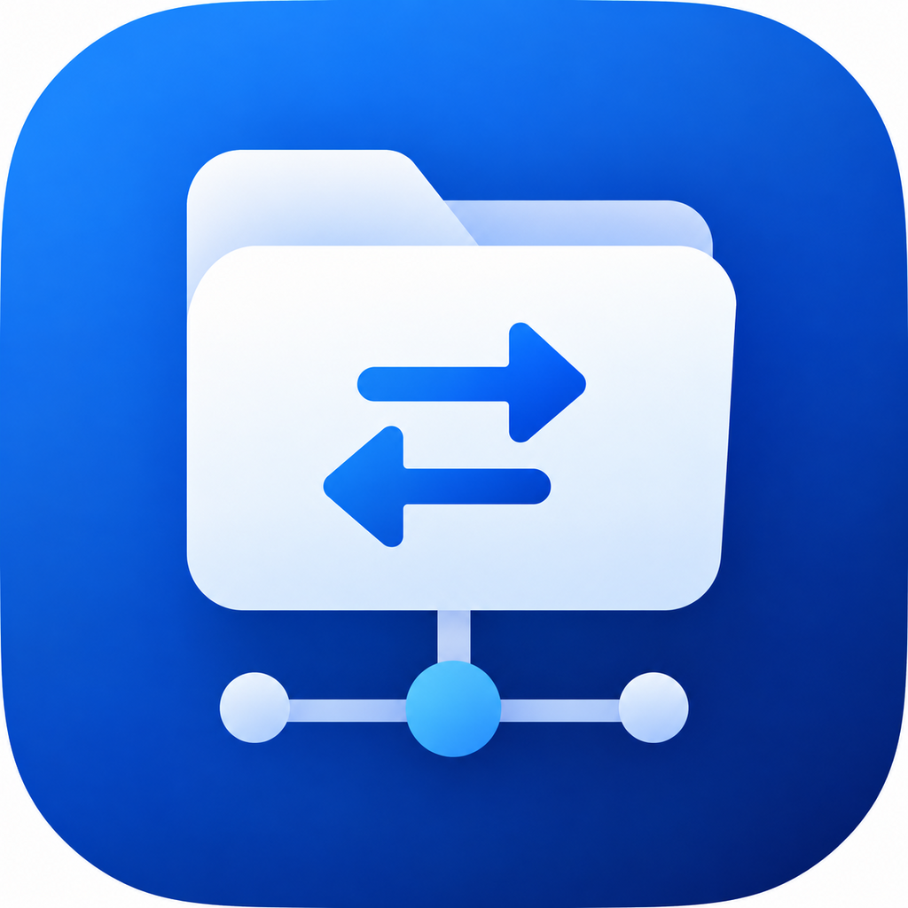

<div align="center">



# RemoteFiles

iPhone 与 iPad 上的多协议远程文件管理器

[](https://github.com/oexi/RemoteFiles/releases/latest)


[](LICENSE)

**FTP · FTPS · SFTP · SMB · WebDAV · NFS**

</div>

---

## ✨ 亮点

- **一处管理所有服务器**：NAS、云主机与局域网共享统一浏览；新建连接时自动发现局域网服务器，SMB 可直接列出共享文件夹。
- **接入系统“文件”App**：通过 File Provider 在“文件”App 中浏览、新建、修改、移动和删除远程文件。
- **可靠的传输**：支持跨服务器复制、后台续传与完成通知；SFTP / SMB 支持流式写入与字节级断点续传，失败任务可重试。
- **随开随看**：Quick Look 预览文档与图片，音视频边下边播、可拖动进度；图片和 PDF 自动生成缩略图。
- **内置代码编辑器**：语法高亮、行号，保留原文件编码（UTF-8 / UTF-16 / GB18030）与权限；先传临时文件再替换，并检测服务器端改动，避免覆盖。
- **压缩包与离线**：浏览或解压 ZIP、7z、RAR、TAR 及 gz / bz2 / xz；文件可保持离线，离线后仍能预览、编辑和分享。
- **安全**：凭据存于 Keychain；支持面容 ID / 触控 ID App 锁；SSH Host Key 与 WebDAV 证书变更时阻止连接。

## 🔌 协议支持

| 协议 | 断点续传 | 边下边播 | 权限 | 符号链接 |
| :-- | :-: | :-: | :-: | :-: |
| **SFTP** | ✅ | ✅ | Unix | ✅ |
| **SMB** | ✅ | ✅ | Windows ACL（只读） | — |
| **WebDAV** | — | ✅ | — | — |
| **FTP / FTPS** | — | — | Unix¹ | ✅ |
| **NFS** | — | ✅ | Unix | ✅ |

<sub>¹ 服务器支持 `SITE CHMOD` 时启用。</sub>

- **SFTP**：密码或 Ed25519 / RSA / ECDSA 私钥（OpenSSH、PEM，可保存 passphrase）；首次连接记录 Host Key，空闲保活、断线重连。
- **WebDAV**：Basic、Digest、NTLM；自签名证书首次信任后固定。
- **FTPS**：可关闭证书验证以连接自签名 NAS。
- 内置连接诊断，逐项检查网络连通、认证、目录访问与服务器能力。

## 📥 安装

在 SideStore 或 LiveContainer 中添加订阅源：

```text
https://raw.githubusercontent.com/oexi/RemoteFiles/main/altstore.json
```

<details>
<summary>URL Scheme</summary>

```text
sidestore://source?url=https%3A%2F%2Fraw.githubusercontent.com%2Foexi%2FRemoteFiles%2Fmain%2Faltstore.json
livecontainer://sources?url=https%3A%2F%2Fraw.githubusercontent.com%2Foexi%2FRemoteFiles%2Fmain%2Faltstore.json
```

</details>

> [!NOTE]
> 发布的 IPA 未签名。SideStore 会在安装时签名；直接安装需自行重签。LiveContainer 不会注册 File Provider 扩展，需要“文件”App 集成时请独立安装。
>
> 在 LiveContainer 中运行时，请在 RemoteFiles 的设置里打开“修复文件导入”（Fix File Picker），否则“上传文件夹”在选择器里点“打开”没有反应。

也可以在 [Releases](https://github.com/oexi/RemoteFiles/releases) 下载 IPA。

## 🛠️ 从源码构建

需要 macOS、Xcode 26 与 [XcodeGen](https://github.com/yonaskolb/XcodeGen)。

```sh
xcodegen generate
open RemoteFiles.xcodeproj
```

项目结构、测试与贡献约定见 [AGENTS.md](AGENTS.md)。

## 📄 许可

[GPL-3.0](LICENSE) · 第三方资源见 [THIRD_PARTY_NOTICES.md](THIRD_PARTY_NOTICES.md)
